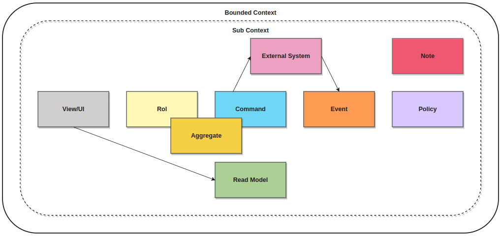

# Event Storming

Template [event storming](https://en.wikipedia.org/wiki/Event_storming) for Drawio.io or diagrams.net. [Click for Open in diagrams.net](https://app.diagrams.net/?clibs=Uhttps://raw.githubusercontent.com/jonathanch7/drawio-templates/master/event-storming/template/event-storming-drawio.xml&splash=0)

## Objects

- Domain Event: Important system event.
- Command: Action that triggers one or more events.
- Role: Individual who executes a command, it can be a person or an external system.
- Policy: Represents a decision/rule business.
- Aggregate: Represents the state of our system. Domain objects that can be treated as a single unit.
- Read Model: read model is a model specialized for reads, that is, queries.
- View: View with which a user interacts.
- External System: External system such as payment gateways or any other type of service that is outside our domain.
- Note: Note or comment about important information.
- Connector: Object connector
- Sub Contex: grouping according to a sub context.
- Bounded Context: Bounded context grouping.
- General Context: General context that groups everything.

)